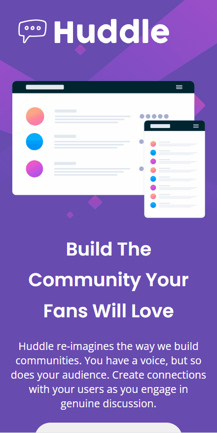

# Quest de HTML + CSS avançado
Projeto proposto pelo curso DevQuest para criação de uma landing page responsiva 💻🚀

## Linguagens utilizadas:
- HTML5
- CSS3

## Objetivo:
Criar uma landing page utilizando todos os conhecimentos em HTML e CSS avançado e deixar responsiva em diversas proporções de telas.

## Dificulades enfrentadas:
Ter criado a estilização e responsividade começando das telas menores para as maiores foi a parte mais dificil do projeto, mas com bastante persistência consegui entregar o resultado mais próximo do que o desafio propôs.